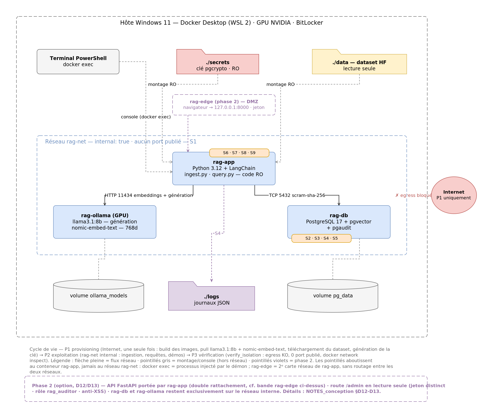
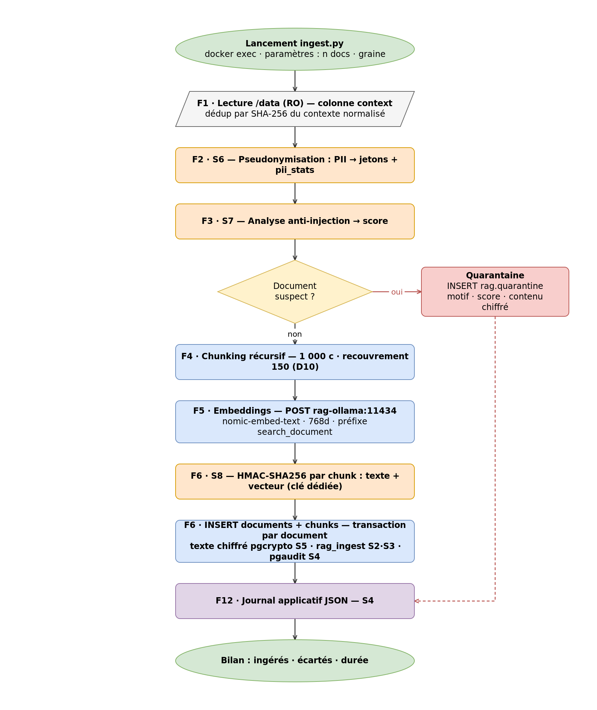
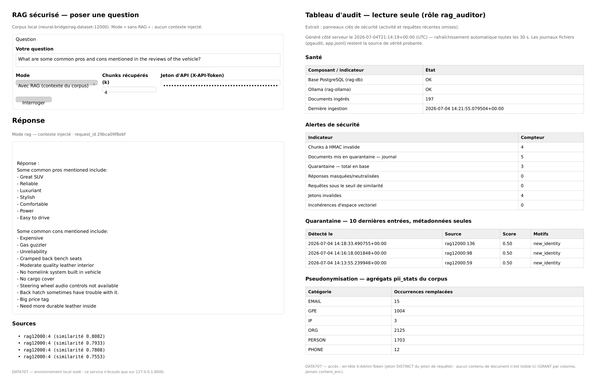

<div class="cover">
<h1>Environnement RAG sécurisé</h1>
<p class="who">Tahiana Hajanirina ANDRIAMBAHOAKA</p>
<p class="date">DATA707 - Sécurité pour le Big Data - Télécom Paris (IP Paris) - juillet 2026</p>
</div>

<div class="abstract">
<p><strong>Résumé.</strong> Ce projet met en place un environnement RAG entièrement local (Ollama, pgvector, LangChain), durci sur le plan de la sécurité : isolation réseau, chiffrement et intégrité de la base, pseudonymisation du corpus et défenses contre l'injection de prompt. Le système a été déployé et exécuté de bout en bout ; le RAG est fonctionnel et sourcé, et chaque mesure de sécurité est démontrée.</p>
</div>

## 1. Objectif et environnement

Un RAG (Retrieval-Augmented Generation) complète les réponses d'un LLM avec des extraits d'une base de connaissances, récupérés à chaque requête. Cet environnement est construit en tout local, puis durci sur le plan de la sécurité. En plus de ce que demande l'énoncé (LLM Ollama, PostgreSQL + pgvector, scripts d'ingestion et d'interrogation, LangChain, dataset neural-bridge/rag-dataset-12000, tableau prompt/réponse), une défense en profondeur a été ajoutée : authentification, autorisation, audit et chiffrement sur la base, pseudonymisation des données personnelles, cryptographie (chiffrement symétrique et HMAC) et protections contre les attaques visant le LLM.

L'hôte est sous Windows 11, la virtualisation se fait avec Docker Desktop (WSL 2), et les machines invitées sont trois conteneurs Linux : l'application Python (LangChain), PostgreSQL avec pgvector, et Ollama pour le LLM. Il n'y a pas de VM à l'intérieur, donc l'isolation vient directement du montage. Le GPU de la machine est ancien et n'a que 2 Go de VRAM, ce qui est trop peu pour faire tourner un LLM open-source ; l'inférence se fait donc sur le CPU. Un modèle léger a été retenu (Llama 3.2 3B au lieu d'un 8B), ce qui ralentit un peu (2 à 3 minutes par réponse) mais ne change rien à la sécurité. L'ensemble a été déployé et exécuté en entier.

## 2. Architecture

<figure><figcaption>Figure 1 : architecture technique (schéma cible ; en pratique tout tourne sur CPU).</figcaption></figure>

Dans les schémas, les repères F désignent les étapes fonctionnelles du traitement, S les mesures de sécurité (S1 à S9), D les choix de conception et P les phases du cycle de vie (provisioning, exploitation, vérification).

Les trois conteneurs sont reliés par un réseau Docker fermé, sans aucun lien vers l'extérieur : aucun port n'est ouvert et on pilote le tout depuis la machine, en ligne de commande. Rien ne peut donc sortir. On n'a besoin d'Internet qu'au tout début, pour télécharger les images, les modèles et le dataset ; ensuite tout tourne en vase clos. En option, une petite interface web (FastAPI) a été ajoutée, accessible uniquement en local, sur la machine elle-même ; la base et Ollama, eux, restent isolés.

## 3. Workflow des traitements

<figure><figcaption>Figure 2 : workflow d'ingestion.</figcaption></figure>

**Ingestion (ingest.py).** Les documents sont lus, les données personnelles remplacées par des tokens avant toute vectorisation (pour qu'aucune PII n'entre dans un vecteur), et ceux qui ressemblent à une tentative d'injection sont écartés. Le texte est ensuite découpé en morceaux, les embeddings sont calculés, et le tout est enregistré en base, chiffré et scellé par un HMAC.

**Interrogation (query.py).** La question est transformée en vecteur, les passages les plus proches sont récupérés dans la base et leur intégrité est vérifiée, puis le prompt est construit en séparant bien le contexte des instructions avant d'appeler le LLM. La réponse est filtrée avant d'être affichée. Un second mode, sans RAG, permet de comparer les réponses avec et sans contexte (les résultats sont présentés en section 6).

## 4. Mesures de sécurité

Plusieurs protections ont été ajoutées :

- **Isolation** : réseau fermé, sans accès vers l'extérieur (cf. section 2).
- **Accès à la base** : connexion par mot de passe, avec des rôles limités au strict nécessaire et un journal d'audit de toutes les opérations.
- **Chiffrement** : le texte des documents est chiffré au repos, la clé restant en dehors de la base.
- **Données personnelles** : le corpus est pseudonymisé avant d'être stocké, donc aucune donnée personnelle brute n'entre dans la base.
- **Sécurité du LLM** : filtrage des tentatives d'injection de prompt, vérification de l'intégrité des passages (par un HMAC) et filtrage des réponses.

## 5. Procédure d'installation (PowerShell, hôte Windows)

Ces scripts PowerShell tournent sur l'hôte Windows et se contentent de piloter Docker (télécharger les modèles, démarrer les conteneurs, lancer les vérifications) ; l'application, elle, s'exécute à l'intérieur des conteneurs Linux. Ils montent tout l'environnement, du téléchargement jusqu'aux requêtes :

```powershell
# 1. Préparation (avec Internet, une seule fois) : télécharge les images, les
#    modèles et le dataset, puis génère les mots de passe et les clés
.\scripts\01_provision.ps1

# 2. Démarrage des trois conteneurs (ensuite, plus besoin d'Internet)
.\scripts\02_up.ps1

# 3. Ingestion des documents dans la base
docker exec rag-app python ingest.py --n-docs 200

# 4. Poser une question
docker exec rag-app python query.py "Ma question ?" --rag

# En option : lancer l'interface web (accessible seulement en local)
.\scripts\02_up.ps1 -Phase2

# Vérifier que rien ne sort vers l'extérieur
.\scripts\03_verify_isolation.ps1
```

## 6. Résultats et démonstrations

197 documents ont été ingérés (909 morceaux en base). Toutes les protections ont ensuite été testées et fonctionnent : par exemple, un mauvais mot de passe est rejeté, les données stockées sont illisibles sans la clé, et un document piégé part en quarantaine sans jamais être vectorisé.

**Tableau prompt / réponse.** Chaque question a été posée au modèle avec et sans RAG. La colonne "bonne réponse" vient du champ answer du dataset (jamais donné au modèle) et sert de référence. Voici trois exemples, avec des extraits réels des réponses du modèle :

| Question | Bonne réponse (dataset) | Réponse sans RAG | Réponse avec RAG |
|---|---|---|---|
| Maladie du bébé de Jimmy Kimmel ? | Tetralogy of Fallot | "Hypoplastic Left Heart Syndrome (HLHS)" : faux, invente même le prénom "Billy" | "Tetralogy of Fallot with pulmonary hypertension" : correct |
| Pros / cons des avis sur le véhicule ? | qualité, confort, puissance / forte conso, prix | générique : "Good fuel economy, Comfortable ride, Spacious interior" | tiré du corpus : "Great SUV, Reliable... Expensive, Gas guzzler..." |
| Ses deux comédies musicales préférées ? | West Side Story, Fiddler on the Roof | invente une conversation et conclut "Chicago and Wicked" | "West Side Story and [PERSON_1] on the Roof" : correct |

Avec le RAG, le modèle retrouve la bonne réponse ; sans corpus, il se trompe ou invente de toutes pièces. La pseudonymisation reste visible dans le dernier exemple : "Fiddler on the Roof" ressort masqué en "[PERSON_1] on the Roof".

## 7. Conclusion

Pour conclure, le RAG local fonctionne et il est protégé sur plusieurs points : réseau isolé, base chiffrée, données personnelles pseudonymisées et défenses contre l'injection de prompt. La principale limite vient du matériel : sans GPU utilisable, tout tourne sur le CPU, ce qui rend les réponses lentes. Avec une meilleure machine, on pourrait passer à un modèle plus gros et gagner à la fois en qualité et en rapidité.

## 8. Interface web et console d'audit

<figure><figcaption>Figures 3 et 4 : interface d'interrogation (/query) à gauche, console d'audit (/admin) à droite.</figcaption></figure>
